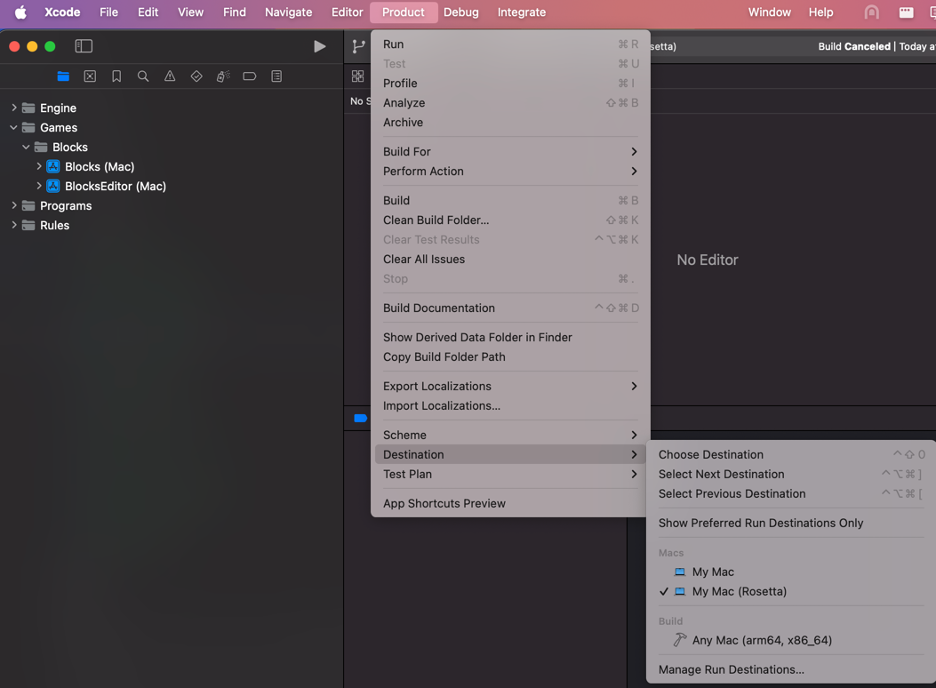
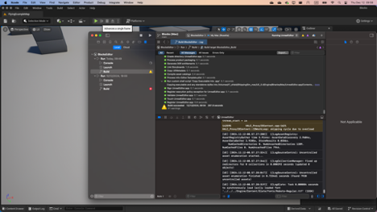

# Install or Build Cosys-AirSim on MacOS (Apple Silicon)

## Install Unreal Engine
1. [Download](https://www.unrealengine.com/download) the Epic Games Launcher. While the Unreal Engine is open source and free to download, registration is still required.
2. Run the Epic Games Launcher, open the `Unreal Engine` tab on the left pane.
Click on the `Install` button on the top right, which should show the option to download **Unreal Engine 5.4.X**. Chose the install location to suit your needs, as shown in the images below. If you have multiple versions of Unreal installed then **make sure the version you are using is set to `current`** by clicking down arrow next to the Launch button for the version. **Make sure that the install path does not contain spaces.** E.g. if you are using an external drive called *My Drive*, rename it to *My_Drive* before installing Unreal Engine on it.

## Build Cosys-AirSim
* Install the latest version of XCode and Apple Developer from the App Store.
* Clone the repo: `git clone https://github.com/Cosys-Lab/Cosys-AirSim.git`, and go the AirSim directory by `cd Cosys-AirSim`. 
* Run `./setup.sh` from the terminal. This will download all nescessary packages.
* Run `./build.sh` from the terminal. This will create ready to use plugin bits in the `Unreal/Plugins` folder that can be dropped into any Unreal project.

## Build Unreal Project

Finally, you will need an Unreal project that hosts the environment for your vehicles. Make sure to close and re-open the Unreal Engine and the Epic Games Launcher before building your first environment if you haven't done so already. After restarting the Epic Games Launcher it will ask you to associate project file extensions with Unreal Engine, click on 'fix now' to fix it. Cosys-AirSim comes with a built-in "Blocks Environment" which you can use, or you can create your own. Please see [setting up Unreal Environment](unreal_proj.md).

## Setup Remote Control (Multirotor only)

A remote control is required if you want to fly manually. See the [remote control setup](remote_control.md) for more details.

Alternatively, you can use [APIs](apis.md) for programmatic control or use the so-called [Computer Vision mode](image_apis.md) to move around using the keyboard.

## How to Use Cosys-AirSim

Once Cosys-AirSim is set up by following above steps, you can,
1. Navigate to directory `Unreal/Environments/Blocks` and run `./update_from_git.sh`.
2. Generate the Xcode project by running `./GenerateProjectFiles.sh {PATH_TO_UE_5.4}` 
3. Open the Xcode project by running `open "Blocks (Mac).xcworkspace"` (or .xcworkspace file in your own [custom](unreal_custenv.md) Unreal project). If you don't see a .xcworkspace file then you probably haven't completed steps in Build Unreal Project section above.
4. AirSim was compiled for x86_64 to be used trough Rosetta-2 (if you followed the previous steps). Therefore, we should now set My Mac (Rosetta) as the target device. There is currently no way to compile AirSim for native Apple Silicon.

<!--  -->

5. Now run the *BlocksEditor (Mac)* application from Xcode. Compilation and launching Unreal Engine for the first time can take several minutes.

!!! tip
    Go to 'Edit->Editor Preferences', in the 'Search' box type 'CPU' and ensure that the 'Use Less CPU when in Background' is unchecked.

See [Using APIs](apis.md) and [settings.json](settings.md) for various options available.

# FAQ

#### I get an error `0x0000 0x0000 0x0000...` or `0x00 is not a valid start of file` when running build.sh
This has to do with how MacOS deals with files that are on cross-platform file systems (like external drives). Run `dot_clean .` in the root directory of AirSim. If this throws permission errors use `sudo chmod -R 777 .` to provide yourself all nescessary permissions. 

#### How do I use PX4 firmware with Cosys-AirSim?
By default, Cosys-AirSim uses its own built-in firmware called [simple_flight](simple_flight.md). There is no additional setup if you just want to go with it. If you want to switch to using PX4 instead then please see [this guide](px4_setup.md).